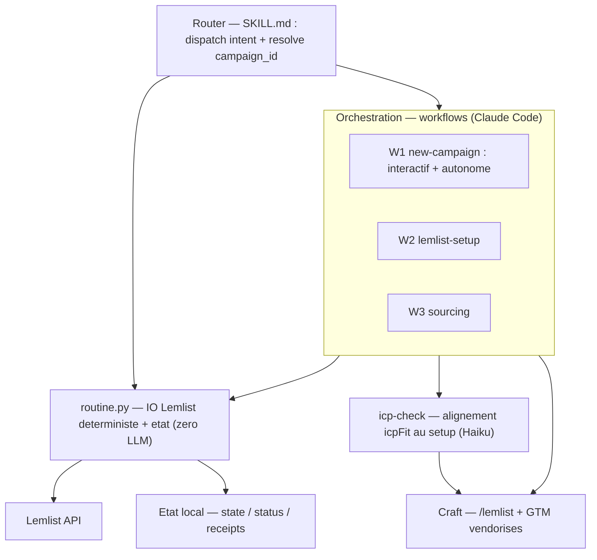

# prospect-routine v2 — architecture v1

Découle de [`design.md`](design.md) (le *pourquoi* + décisions). Ici : le *comment* — frontières de composants, arborescence, flux, dépendances, contrats, points d'extension. À poser avant le build spec-par-spec. **Moteur de livraison = « charger puis lancer » (C)**.

---

## 1. Couches & dépendances (sens unique, zéro cycle)



**Règle de dépendance** : Router → Orchestration → (Scripts | Craft) → (Lemlist | State). Jamais l'inverse.
- `routine.py` est le **seul** point d'IO Lemlist déterministe (testable, pièges WAF/retry centralisés, zéro LLM).
- Les workflows **n'écrivent dans Lemlist que via `routine.py`** — exception unique documentée : l'agent *sourcing* de W3 fait le `curl` People DB (il lit la clé locale).
- La **craft** ne fait aucun IO (guidance/génération uniquement).

---

## 2. Arborescence

```
Code/drivenlabs-ai/prospect-routine/                # plugin (repo git, source de vérité)
├── .claude-plugin/plugin.json                      # manifeste
├── skills/prospect-routine/SKILL.md                # ROUTER (mince, trigger langage naturel)
├── scripts/
│   ├── routine.py                                  # moteur — sous-commandes atomiques (cf. §5)
│   └── sync-workflows.sh                            # copie workflows → ~/.claude/workflows/
├── workflows/                                       # source versionnée des workflows (fan-out d'agents)
│   ├── sourcing.workflow.js                        # W3 — GÉNÉRÉ depuis lib/sourcing-core.js
│   ├── new-campaign.workflow.js                    # W1 phase 2 (autonome) — à venir
│   ├── icp-check.workflow.js                       # alignement icpFit au setup — GÉNÉRÉ depuis lib/icp-check-core.js
│   └── lib/                                         # logique déterministe testée + générateur
│       ├── sourcing-core.js                        # helpers purs + runSourcing (node --test)
│       └── build-workflow.js                       # génère le .workflow.js self-contained
│   # (W2 lemlist-setup = procédure déterministe du routeur, pas un .workflow.js — cf. spec 02)
├── agents/                                          # sourcing / scoring / juge (à venir)
├── hooks/hooks.json                                # SessionStart → sync-workflows.sh
├── references/
│   ├── operations.md · lemlist-api.md · setup-vertical.md
│   ├── flow-default.json                           # template séquence multicanal par défaut
│   └── gtm/                                         # GTM vendorisés (à la demande)
├── docs/ : design.md · architecture.md · specs/
└── tests/

~/.claude/workflows/                                # MIROIR runtime (copié par le hook)
└── *.workflow.js                                    # → deviennent /W1 /W2 /W3 ; appelés d'ici

Drivenlabs Team/Drivenlabs/Prospection/             # intelligence métier (SoT, Drive)
├── icp-global.md                                    # positioning transversal (versionné)
├── campaigns-registry.json                          # slug ↔ campaign_id ↔ dossier (unicité)
└── <Vertical>/
    ├── icp.md · persona.md · pain-points.md · value-proposition.md · triggers.md
    ├── campaign.json                                # linkage + config (cf. §5)
    └── prompts/ : icpFit.md + <step>.md (1 par message)
    # (pas de dataset : icp-check teste l'icpFit sur un échantillon live au setup, cf. spec 04)

~/.claude/prospect-routine/<slug>/                   # état machine (jamais Drive)
├── state.json        (seen_lead_ids, history)
├── status.json       (machine d'état / reprise)
├── receipts/push-<date>.json   (idempotence push)
└── log.md
```

---

## 3. Frontières de composants

| Composant | Responsabilité | NE fait PAS |
|---|---|---|
| **Router** (`SKILL.md`) | Résout l'intent + le `campaign_id`/slug, délègue | aucune logique métier ni IO |
| **routine.py** | Toutes les lectures/écritures Lemlist + l'état, déterministe | aucun LLM, aucune décision métier |
| **Workflows** W1/W2/W3 | Orchestrent agents + scripts ; idempotents/reprenables (`status.json`) | pas d'IO Lemlist en direct (via routine.py) |
| **Craft** (`/lemlist` + GTM) | Génère les artefacts (ICP, prompts) guidés, enveloppés de la voix | aucun IO, aucune décision de gate |
| **icp-check** | Alignement icpFit au setup : Haiku juge un échantillon → verdicts bruts (parité prod) | ne décide pas seul du gate (Claude de session + sign-off humain) ; ne modifie aucun fichier |
| **State** | `state` (seen/history) · `status` (phases/reprise) · `receipts` (idempotence) | — |

---

## 4. Flux des 3 commandes (modèle C)

**Créer** : Router → **W1** [phase 1 interactive : recherche + Q&A → validation ICP/angle] → [phase 2 autonome : craft génère icp/pains/prompts → **icp-check** (alignement icpFit sur échantillon + sign-off humain)] → **W2** [crée campagne + séquence multicanal (template) + liste audience] → smoke 1 lead → maj `campaigns-registry`.

**Modifier** : Router → `resolve` → `fetch` (snapshot Lemlist) → edit ciblé sous garde `edit_in_progress` :
- *ICP* → fichiers locaux (draft `.tmp` → promotion après re-`icp-check`) ;
- *+étape* → mutation séquence Lemlist + nouvelle variable + `verify` ;
- *timing* → mutation des délais.

**Run (sourcing)** : Router → `resolve` → **W3** [`verify` pré-run → sourcing → scoring `icpFit` (Haiku) → rédaction par étape] → **par lead** : `dedup-check` (exclusivité + opt-out) → `upsert-contact` → `add-to-list` → `create-lead` (`deduplicate`) → `set-variables` → `launch` → `receipt` + `record-run`.

---

## 5. Contrats (schémas)

```jsonc
// campaign.json
{ "campaign_id":"cam_…", "slug":"agence-immo", "list_id":"clt_…",
  "filters":[…], "models":{"scoring":"haiku","writing":"haiku","judge":"sonnet"},
  "dry_run":false, "sequence_variables":["icebreaker","followup","closing"],
  "template_version":"1.0", "icp_global_version":"1" }

// campaigns-registry.json (racine Prospection)
[ { "slug":"agence-immo", "campaign_id":"cam_…", "folder":"Agence Immo", "channels":["linkedin","email"], "status":"active" } ]

// status.json (état machine, reprise)
{ "phase1_done":true, "w2_steps":["campaign","sequence","list"], "edit_in_progress":false, "last_run":"2026-06-12" }
```

**Surface Lemlist (modèle C)** : `upsert-contact` · `add-contacts-to-list` · `create-lead-in-campaign(deduplicate)` · `add/update-lead-variables` · `launch-lead` · `get-many-contacts(campaign membership)` · `unsubscribes` · `get-campaign` / `get-campaign-leads` / `get-campaign-statutes` · `update-campaign(sequence/delais)` · `pause`/`start`.

---

## 6. Points d'extension

- **Nouvelle verticale** → `W1` (zéro code).
- **Nouveau canal** → `flow-default.json` + `W2`/edit.
- **Nouveau type d'edit** → un sous-flow + une mutation `routine.py`.
- **v1.5 coordination** → module *rate-limiter à jeton partagé* que `routine.py` consomme + `campaigns-registry.json` comme source d'agrégation (dashboard, budgets).
- **v2** → workflows `conversion` (reply-handler) / `analyse` (outbound-analyst) branchés au Router.

---

## 7. ADR (décisions courtes)

1. **`routine.py` = unique IO Lemlist déterministe** → testabilité + centralisation des pièges (WAF, 429, dédup).
2. **Workflows = orchestration only** → pas de logique d'IO dupliquée.
3. **SSoT** : structure dans Lemlist (lue via `fetch`), intelligence en local ; `campaign_id` = pont.
4. **Livraison C** (« charger puis lancer ») → ancrée sur le smoke test (la sync n'ingère pas campagne en pause).
5. **Idempotence/reprise** portée par `status.json` + `receipts/` (W1/W2/W3 reprenables).
6. **Packaging plugin versionné** (repo `Code/`) plutôt que dossier-skill global non tracké → historique git, rollback, review spec-par-spec, alignement règle de routage du hub.
7. **Workflows synchronisés par hook `SessionStart`** → « workflow » n'est pas un composant de plugin reconnu (vérifié doc). Le repo est source de vérité ; `sync-workflows.sh` les copie (pas symlink — racine de cache instable en marketplace) vers `~/.claude/workflows/`, leur maison officielle. Le Router les appelle de là, jamais via `${CLAUDE_PLUGIN_ROOT}` (chemin non documenté).

---

## Prochaine étape

Spec par spec (ordre des dépendances) : **routine.py (scripts atomiques)** d'abord (socle), puis **W2**, **W3**, **icp-check**, **W1**, **Router**. Chaque spec : `/brainstorming` → design → implémentation (+ `/skill-creator` pour les skills, lecture de la doc Claude Code workflows pour W1/W2/W3).
