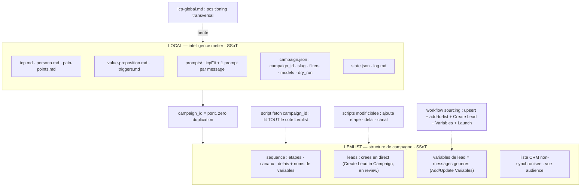
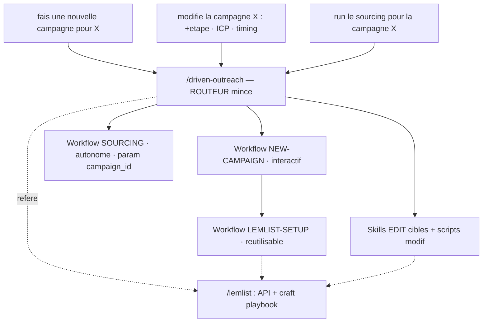
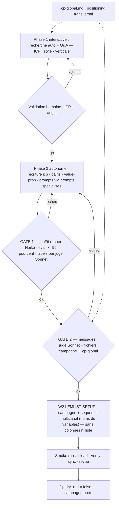

# outreach v2 — design à valider

> **Révision 2026-06-19 — graders → `icp-check`.** Les « 2 graders bloquants » (GATE 1 ≥ 95 % sur
> holdout, GATE 2 juge Sonnet, datasets labellisés) décrits plus bas (§4, §11.6) ont été **abandonnés
> comme sur-ingénierie** à cette échelle. Remplacés par une **passe d'alignement `icp-check` au setup**
> (mini-workflow : Haiku juge un échantillon → Claude de session compare à l'intention, itère le prompt
> → sign-off humain). Référence : `docs/specs/04-icp-check.md`. Les mentions « graders / GATE / holdout »
> ci-dessous sont la **vision initiale, superseded** — conservées pour l'historique.

Refonte de `/driven-outreach` : passer d'un moteur mono-workflow à un **routeur** qui orchestre setup pro (via le métier `/lemlist`), run, et édition ciblée — avec un découpage **single source of truth** strict entre Lemlist et le local.

> **Commente directement dans ce fichier** (sous chaque décision, ou en annotation). Je rédige le plan d'implémentation v1 une fois les 4 décisions tranchées.

---

## ✅ Décisions à valider (le cœur)

1. **Skills GTM** : `/lemlist` comme **hub métier unique** (il distille déjà la doctrine des 38 skills l3mpire) + vendoriser paresseusement **2-3 templates structurés** (`icp-definer`, `outbound-campaign-architect`, `people-finder`) sous `outreach/references/gtm/`. → **NE PAS installer les 38.**
   - [x] Validé.

2. **SSoT structure** : **Lemlist = source de vérité de la structure de campagne** (séquence, canaux, délais, leads + variables). Le local ne la copie jamais. Un script `fetch` lit ; des scripts de **modif ciblée** écrivent.
   - [x] Validé.

3. **Identifiant** : workflows paramétrés par `campaign_id`, mais resolver acceptant **slug humain OU `campaign_id`** (mappés dans `campaign.json`).
   - [x] Validé.

4. **Périmètre v1** : tel que cadré au §9 (routeur 3 commandes + fetch + W2 setup Lemlist + W3 sourcing + W1 new-campaign à 2 graders + 3 edits ciblés), **multicanal dès v1**.
   - [x] Validé.

### Affinements & révisions validés

- **W1** : phase 1 interactive jusqu'à **validation ICP + angle**, puis phase 2 = **workflow autonome** à prompts spécialisés (les 2 graders y vivent).
- **Graders** : runner `icpFit` **reste Haiku** (parité prod) ; le **juge est Sonnet**, nourri de tous les fichiers campagne **+ une nouvelle couche `icp-global.md`** (racine Prospection).
- **Livraison** *(pivot — colonnes abandonnées)* : modèle **« charger puis lancer »** — `upsert contact` → `Add to List` (audience, non synchronisée) → `Create Lead in Campaign` (direct, marche en pause) → `Add/Update Variables` (messages) → `Launch`. Smoke test : la sync n'ingère pas campagne en pause, d'où le create direct. Détail : §11.1.

---

## 1. Objectif

Mode de travail visé, simple :

- *« fais une nouvelle campagne pour la verticale X »* → **phase 1 interactive** (recherche + Q&R jusqu'à validation de l'ICP et de l'angle), puis **phase 2 autonome** — workflow à prompts spécialisés : écriture des fichiers locaux, 2 graders bloquants, création Lemlist (campagne + séquence multicanal par défaut). Les leads sont ajoutés par run en review puis approuvés (variables de lead, cf. §11.1).
- *« modifie la campagne X : +étape / affine l'ICP / change le timing »* → comprend quels fichiers / paramètres Lemlist toucher.
- *« run le sourcing pour la campagne X »* → lance en autonomie l'extraction de leads filtrés ICP + rédaction des messages + push.

---

## 2. Modèle SSoT — zéro réplication (le changement structurant)

Le critère « pas de réplication Lemlist ↔ local » impose ce découpage. Il **invalide** l'idée antérieure d'un `flow{}` stocké en local (il dupliquerait la séquence Lemlist).

- **Lemlist = SoT structure** : séquence (étapes, canaux, délais, conditions + **noms de variables** référencés) + **leads et leurs variables** (valeurs des messages, posées par run) + une **liste CRM non synchronisée** par campagne (vue audience browsable/exportable) ; les leads sont créés **en direct** (`Create Lead in Campaign`) — cf. §11.1.
- **Local = SoT intelligence métier** : icp / persona / pains / value-prop / triggers, prompts (icpFit + 1 par message), filtres People DB, voix, état.
- **Couche ICP globale** (`Prospection/icp-global.md`) : positioning transversal dont chaque campagne hérite ; lue par la compréhension (W1) et par les juges des graders.
- **Pont = `campaign_id`**. Le `campaign.json` local ne garde que le linkage + la config sourcing — **pas la séquence**.
- Lien prompts ↔ Lemlist : convention `prompts/<step>.md` ↔ **variable de lead** `{{step}}` (posée par run via `Add/Update Variables`, **plus aucune colonne** — cf. §11.1), contrôlée par `verify` + la garde native de `Launch Lead`.

Conséquence directe : un *changement de timing/flow* est une **mutation dans Lemlist** (via script), jamais un edit local répliqué.

---

## 3. Routage — `/driven-outreach` comme routeur mince

- **W1 NEW-CAMPAIGN** = orchestration **interactive** (toi dans la boucle).
- **W2 LEMLIST-SETUP** et **W3 SOURCING** = **vrais `Workflow()` autonomes**, réutilisables, paramétrés par `campaign_id`.
- **`/lemlist`** = référencé pour **toute** mutation Lemlist (API) **et** le craft (architecture séquence, copy, ICP).

---

## 4. Workflow NEW-CAMPAIGN (interactif, 2 graders bloquants)

- **GATE 1 — ICP** : le prompt `icpFit` tourne sur le **runner Haiku** (parité avec la colonne IA de prod — un juge plus fort ici fausserait le score). La **vérité-terrain de l'échantillon est labellisée par un juge Sonnet** nourri de `icp.md` + `icp-global.md`. Gate : ≥ 95 % (harnais `eval.workflow.js`).
- **GATE 2 — messages** : **juge Sonnet** connecté à **tous les fichiers campagne** (icp, pains, value-prop, voix) **+ `icp-global.md`**, par-dessus le filtre déterministe `is_clean_message`. Juge la voix, l'absence de fait inventé, l'adéquation à l'angle.
- Pas de `flip dry_run` tant que les deux gates ne passent pas.

---

## 5. Décision skills + implications

`/lemlist` porte déjà `outbound-playbook.md` : ICP & persona, config search, architecture de séquence + benchmarks, copywriting par séniorité, CTA, LinkedIn, reply handling, analytics. Il **distille la même doctrine** que les 38 skills l3mpire.

| Option | Implications |
|---|---|
| **Installer les 38** | ✗ réplique la doctrine `/lemlist` (drift dans le temps) · ✗ 38 descriptions chargées à chaque session (taxe contexte) · ✗ collisions de triggers (les `copywriting-*` se déclenchent sur toute rédaction) · ✗ voix générique EN hors-contexte · ✗ 38 fichiers à resynchroniser avec l'upstream |
| **`/lemlist` = hub unique** (recommandé) | ✓ zéro réplication (SSoT doctrine) · ✓ zéro taxe session · ✓ `/driven-outreach` choisit le craft à chaque étape et l'enveloppe de ta voix · ✗ les formats *structurés* de 2-3 skills ne sont pas invocables en standalone |
| **Vendoriser 2-3 templates clés** à la demande | ✓ récupère les formats structurés que le playbook en prose n'a pas · chargés uniquement pendant un setup/edit · ✗ une mini-copie à garder à jour |

**Arbitrage proposé** : `/lemlist` comme hub + vendoriser `icp-definer`, `outbound-campaign-architect`, `people-finder` sous `outreach/references/gtm/`, chargés à la demande.

---

## 6. Implications des autres décisions

- **`flow` côté Lemlist** (vs local) → exige le script `fetch` + scripts mutation, supprime toute duplication. Le modèle de flux par défaut vit **une fois** dans le plugin (template), instancié dans Lemlist au setup.
- **`campaign_id` opaque (`cam_…`)** → support des **deux** : slug humain (« agence-immo ») et `campaign_id`, via resolver dans `campaign.json`.
- **Multicanal v1** → template par défaut LinkedIn + email dès le départ ; W2 crée la séquence multicanal (qui référence les **noms de variables**) ; check des canaux d'envoi connectés (garde-fou `/lemlist`).
- **Livraison « charger puis lancer »** *(cf. §11.1)* → chaque run : `upsert contact` → `Add to List` (audience, non synchronisée) → `Create Lead in Campaign` (direct) → `Add/Update Variables` (messages) → `Launch Lead`. Zéro colonne-message ; marche campagne en pause ; changer le flow = générer d'autres variables.
---

## 7. Ce que je challenge dans la spec

1. **« tout est un workflow »** → non : W1 = **phase 1 interactive** (jusqu'à validation ICP + angle) puis **phase 2 = workflow autonome** à prompts spécialisés. W2/W3 restent des workflows autonomes.
2. **« testing avec grader »** → **2 gates bloquants** avant `flip dry_run` : ICP (runner Haiku, ≥ 95 %, labels Sonnet) et messages (**juge Sonnet + contexte complet + `icp-global`**).
3. **« flux par défaut »** → **template plugin unique**, pas un fichier par campagne (sinon réplication).

---

## 8. Les 3 commandes → l'architecture

- **« fais une nouvelle campagne pour X »** → W1 interactif (compréhension → écriture locale → 2 graders) → W2 (campagne + séquence multicanal) → smoke → prêt.
- **« modifie la campagne X »** → le routeur résout `campaign_id`, charge le snapshot `fetch`, route vers l'edit ciblé : ICP → fichiers locaux + re-grade ; +étape/timing → mutation de la séquence Lemlist (+ nouvelle variable si +étape).
- **« run le sourcing pour la campagne X »** → W3 autonome (param `campaign_id`) → sourcing → scoring icpFit → rédaction par étape → pour chaque lead : `upsert contact` + `Add to List` + `Create Lead` + `Set Variables` + `Launch`.

---

## 9. Périmètre v1 vs v2

---

## 10. Principe modulaire

Routeur mince · workflows réutilisables **paramétrés par `campaign_id`** · scripts atomiques (`fetch` + mutations ciblées) · `/lemlist` = hub métier · **Lemlist = SoT structure**, **local = SoT intelligence**.

---

## 11. Stress test — angles morts & garde-fous

5 sous-agents adversariaux. L'ossature (routeur + SSoT + workflows) tient ; il manquait **3 couches transverses**, et une décision (colonnes) a été renversée. Garde-fous, par priorité.

### 11.1 — Livraison : « charger puis lancer » — Create Lead direct + variables — v1

**Faits vérifiés** : (a) champ contact = UI-only (colonnes-messages rigides) → **abandonnées** ; (b) la ressource `leads` permet tout sans colonnes : `Create Lead in Campaign` (create **direct**, param `deduplicate`), `Add/Update Variables` (libres, l'`Add` **auto-crée**), `Launch Lead` (lance un lead en review, **garde native** : refuse si une variable requise manque) ; (c) **smoke test** : la sync liste→campagne **n'ingère pas campagne en pause** → on n'utilise PAS la sync pour créer les leads.

**Modèle retenu — « charger puis lancer »** (synchrone, marche **même campagne en pause**, contrôle maximal) :
1. `upsert contact` (identité) → `Add to List` (liste **non synchronisée**, vue audience).
2. `Create Lead in Campaign` (`deduplicate:true`) → lead **en review** (create **direct**, indépendant du statut de la campagne).
3. `Add/Update Variables` → messages posés sur le lead (noms libres, **aucune colonne**).
4. `Launch Lead` (par lead ou par lot) quand tu valides → entre dans la séquence.

**SSoT — pas de double création** : 3 faits distincts sur 1 contact — identité (contact, dédup `linkedinUrl`), appartenance liste (audience), lead campagne (envoi). La liste **n'étant pas synchronisée**, elle ne crée aucun lead → zéro duplication.

**Pourquoi C (direct) plutôt que la liste synchronisée** : le smoke test montre que la sync **n'ingère pas campagne en pause** → impossible de « charger un lot puis lancer ». C est synchrone, fonctionne en pause, et te laisse **préparer + revoir + lancer** un lot — ta façon de bosser.

**Conséquence SSoT** : Lemlist garde la **séquence** (+ noms de variables) + les **leads, leurs variables, la liste** ; le local garde les **prompts** qui génèrent les **valeurs**. Contrat = noms de variables ↔ clés de prompts, contrôlé par `verify` + la garde `Launch Lead`.

**Exclusivité & opt-out — natifs (vérifié doc 2026-06-15)** : `create-lead?deduplicate=true` exclut nativement un email déjà présent dans une **autre campagne** ; l'opt-out est appliqué nativement à l'envoi (suppression `unsubscribes`). On passe donc **toujours `deduplicate=true`** ; pour les leads LinkedIn-only (sans email), nos **reçus** (clé linkedinUrl) couvrent nos campagnes. Pas de pré-check `Get Many Contacts` ni de dedup-set local — redondant avec le natif (cf. spec 01 §0).

**Nuances (vérifié sur le compte)** : `icebreaker/followup/closing` sont des **champs custom créés par nous** (`icebreaker` n'est un défaut qu'au niveau *variable de lead*). L'`Add` lead-variables **auto-crée** ; nom existant (agence-immo) → `Update`.

### 11.2 — Coordination cross-campagne — largement NATIF (révisé 2026-06-15)

Vérification doc : la **cadence et la sécurité d'envoi sont gérées nativement par Lemlist** (*Sending limits* par boîte, 24 h glissantes, algorithme d'étalement, auto-pause near quota). Nos actions `load`/`launch` n'envoient rien — `launch` enfile, Lemlist diffuse sous ses propres limites. **Le moteur ne construit donc PAS** de rate-limiter d'envoi, token-bucket, run-lock ni circuit-breaker (sur-ingénierie vs natif). Restent côté nous : (a) respecter le **rate limit API 20 req/2s** (honorer `Retry-After`/429 — runs concurrents = au pire un back-off, pas un risque de suspension) ; (b) **registre central** `campaigns-registry.json` (unicité slug + lookup) ; (c) lire le `limitation` People DB au sourcing (quota natif/24 h).

### 11.3 — Couche machine d'état & reprise — v1 *(angle mort majeur)*

W1/W2 sont tout-ou-rien, sans reprise (W2 crashe à mi-création → campagne dupliquée ; W1 abandonné → re-run repart de zéro et écrase). Garde-fous : `status.json` par campagne (flags `phase1_done` / `w2_steps[]`) ; **création idempotente** (check-exists-before-create sur liste/campagne/séquence) ; **push-receipt** append-only (skip les `ctc_` déjà poussés) ; **bornes d'itération + escalade humaine** sur les graders (sinon boucle infinie/coût) ; jamais d'overwrite de fichier local sans confirmation.

### 11.4 — Filets SSoT avec déclencheur — v1

`verify` (alignement prompts ↔ **noms de variables de la séquence**) devient un **pré-push obligatoire hardcodé** dans W3, + au démarrage de session, + avant tout edit ; côté envoi, la garde native de `Launch Lead` refuse tout lead dont une variable requise manque. Checks de statut : `GET /campaigns/{id}` (404 / archivé → bloque), `dry_run` local **croisé** avec le statut réel (active/pause) de la campagne, `template_version` stocké dans `campaign.json`.

### 11.5 — Éditions à chaud sécurisées — v1 restreint

Le comportement Lemlist sur l'insertion de step / changement de délai **avec des leads in-flight n'est pas documenté → à tester en bac à sable AVANT d'exposer la commande**. Règles : tout edit de structure sur campagne live = **pause + backfill des variables manquantes + décision humaine explicite** ; un changement d'ICP avec leads déjà poussés exige une décision (retirer via `DELETE /campaigns/{id}/leads` ou laisser) ; `delete-step` **hors v1** ; transaction cross-SoT (flag `edit_in_progress`, écriture draft dans `.tmp/` → promotion après gate, jamais l'inverse).

### 11.6 — Rigueur des graders — v1

- **Holdout set** jamais vu à l'itération → le gate ≥ 95 % s'évalue dessus (le dataset de dev sert au debug). Tue l'overfit / le gaming (retrait des cas durs).
- **Labels signés humain** : le juge Sonnet pré-labellise en draft, mais la vérité-terrain est validée à la main (≥ échantillon de contrôle) → casse la circularité « le juge labellise ET juge ».
- **Rubrique booléenne** pour GATE 2 (pas de fait inventé / angle cohérent / zéro formule interdite / vouvoiement — la longueur est pilotée par le prompt d'étape, pas jugée) → verdict reproductible ; multi-vote sur cas limites.
- **Taille min de dataset** (≥ 30, ≥ 10/classe) + intervalle de confiance affiché ; vivier insuffisant → élargir avant de gater.
- **Re-gate périodique + pin du model ID Haiku** (le gate one-shot périme à chaque nouvelle version du modèle de prod).

### 11.7 — icp-global.md — v1

À **créer** (n'existe pas encore), **versionner**, et définir la **précédence** vs `prospection-icp.md` existant (lequel l'emporte si contradiction de scope/taille). Référencé par version dans `campaign.json`.

---

## 12. Migration agence-immo (vers variables de lead)

`agence-immo` tourne aujourd'hui en mode **colonnes + liste synchronisée** (`clt_pMBJ…` → `cam_HsK…`, colonnes `icebreaker/followup/closing`), 20 leads en review. Bascule :

1. **On garde** la campagne + sa séquence (elle référence déjà `{{icebreaker}}` / `{{followup}}` / `{{closing}}`).
2. **Les 20 leads en review restent** tels quels (variables déjà posées) — approbation normale.
3. **Désynchroniser** la liste `clt_pMBJ…` de la campagne (le create direct la remplace) ; la garder comme liste simple (audience).
4. **Dès le prochain run**, W3 : `upsert contact` → `Add to List` → `Create Lead in Campaign` (`deduplicate:true`) → `Update Variables` (les 3 noms existent → `Update`) → `Launch`.
5. **Test bac à sable 1 lead** (create → variables → launch) avant de basculer le run quotidien.

---

## Prochaine étape

Pivot livraison (variables de lead) + garde-fous du stress test (§11) + migration agence-immo (§12) intégrés. Le **v1 reste à re-prioriser** (couches v1-critiques : coordination cross-campagne, machine d'état, exclusivité contact, rigueur graders) avant le plan d'implémentation détaillé : arborescence, signatures de scripts (`fetch` / mutations / create-lead-variables-launch), template de séquence multicanal par défaut, mapping prompts ↔ variables, harnais des 2 graders.
